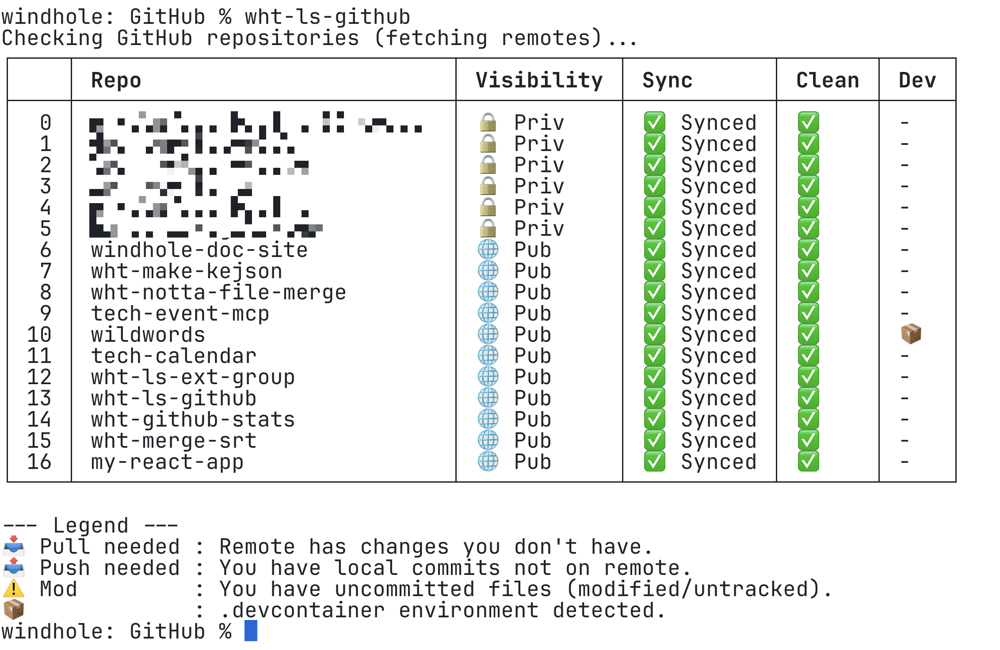

# wht-ls-github

macOS上のローカルディレクトリにあるGitHubリポジトリ群の状態を、一括で確認・表示するためのBun製CLIツールです。

## 🌟 主な機能

- **リポジトリ一覧の自動取得**: `~/Documents/GitHub` 配下を自動スキャン。
- **最終更新順ソート**: 直近で作業したリポジトリが一番上に表示されます。
- **公開/非公開の判定**: `gh` コマンドを使用して、GitHub上のPublic/Private設定を表示。
- **リモート同期状態の検知**: 
    - `Pull needed`: リモートにある更新をローカルに反映していない状態。
    - `Push needed`: ローカルにあるコミットをリモートに送っていない状態。
- **ローカルのクリーン判定**: 未コミットの変更（Modified）があるかを表示。
- **DevContainer検知**: `.devcontainer` 設定の有無を確認。

## 🚀 動作環境

- **macOS** (Apple Silicon / Intel)
- **Bun** (v1.0.0以上)
- **GitHub CLI (`gh`)**: ログイン済みであること
- **Git**

## 📦 インストールと実行

1. **スクリプトの配置**
   `wht-ls-github.ts` として保存します。

2. **実行**
   ```bash
   bun run wht-ls-github.ts

## 出力例
※プライベートリポジトリ名はマスクしています


