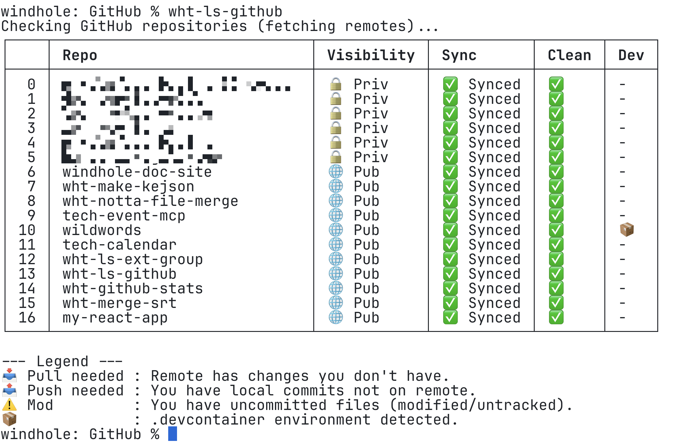

# lsg

ローカルディレクトリにある GitHub リポジトリ群の状態を、一括で確認・表示するコマンドです。

既定では `~/Documents/GitHub` 直下を、ディレクトリの mtime が新しい順に見ます。git リポジトリで GitHub と連携しているものは `git fetch` したうえで、公開範囲・リモートとの差・未コミット変更・`.devcontainer` の有無を表に出します。git 未初期化や GitHub 未連携も、その旨が分かる行として出します。GitHub で archive されたものは既定では出しません。

| フラグ | 動き |
|--------|------|
| （なし） | 既定の `~/Documents/GitHub` を走査する（archive は除く） |
| `--dir PATH` | 指定したディレクトリ直下を走査する |
| `--all` | archive されたリポジトリも表示する |
| `--proj` | 名前が `proj-` で始まるディレクトリだけ表示する |
| `--wh` | 名前が `wh` または `windhole-` で始まるディレクトリだけ表示する |
| `--version` | バージョンだけ表示する |
| `--help` / `-h` | 使い方を表示する |

## 前提

PATH にあれば足りるもの:

- git
- [GitHub CLI (`gh`)](https://cli.github.com/)（対象ホストにログイン済み）

ホストやユーザーは `gh` の現在の認証先に従います。URL は埋め込んでいません。

配布バイナリの対象は macOS（Apple Silicon）です。実行側に Go は不要です。

## 入れ方

[Releases](https://github.com/windhole/wht-ls-github/releases) から `lsg` を落とし、実行権限を付けて PATH へ置きます。

```bash
chmod +x lsg
install -m 0755 lsg "$HOME/bin/lsg"
```

ソースからビルドする場合は [development.md](development.md) を見てください。

## 使い方

```bash
# 既定の ~/Documents/GitHub を走査する
lsg

# 走査先を指定する
lsg --dir /path/to/repos

# archive も含める
lsg --all

# 名前が proj- で始まるものだけ
lsg --proj

# 名前が wh または windhole- で始まるものだけ
lsg --wh

# バージョンだけ
lsg --version
```

GitHub と連携しているリポジトリでは `git fetch` します。`git init` していないディレクトリは `🚫 no git`、git はあるが `gh repo view` が失敗するものは `☁️ no GitHub` と出します。`--proj` と `--wh` を両方付けると、どちらかに合うものを出します。

## 表示すること

- **Repo**: ディレクトリ名
- **Visibility**: GitHub 上の Public / Private。archive は `🗄️ Priv` / `🗄️ Pub`。未連携は `-`
- **Sync**: 追跡ブランチとの差（Synced / Pull needed / Push needed / Diverged）。未初期化は `🚫 no git`、未連携は `☁️ no GitHub`
- **Clean**: 未コミットの変更（modified / untracked）があるか。git でないときは `-`
- **Dev**: `.devcontainer` があるか

隠しディレクトリ（`.` で始まるもの）は走査しません。

## やらないこと

- リポジトリの作成、push、pull の実行
- Organization 配下や、走査先より深い階層の再帰走査
- Intel Mac / Linux 向けバイナリの配布

## 出力例

※プライベートリポジトリ名はマスクしています


